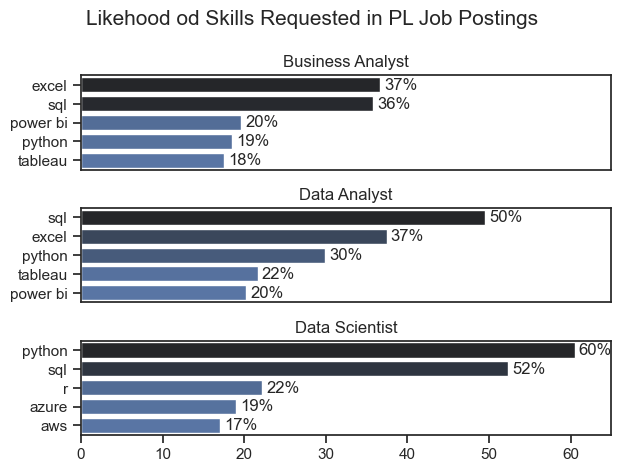
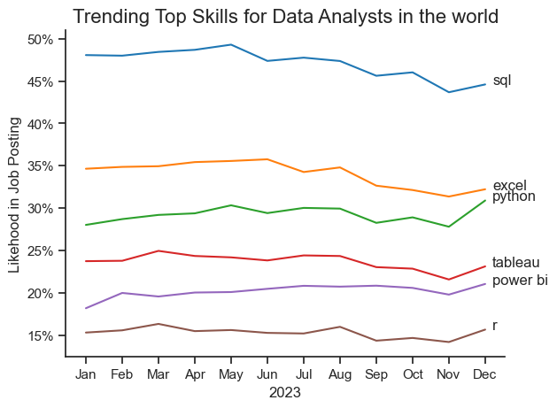
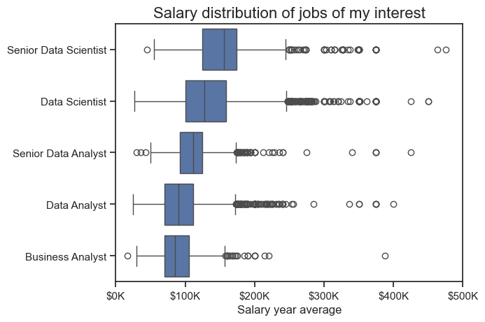
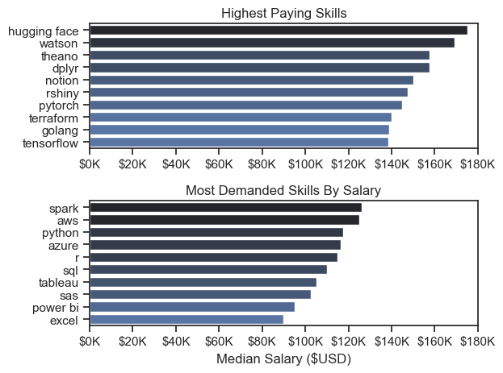
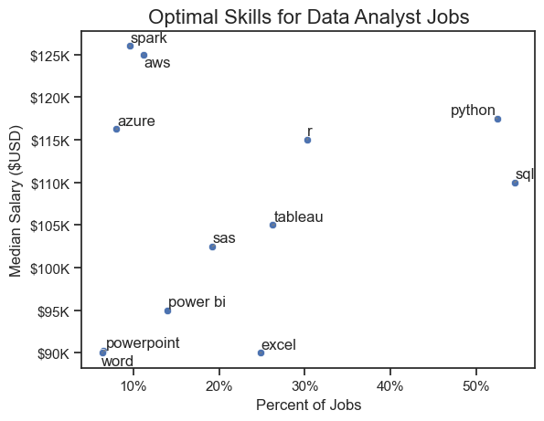

# Overview

Welcome to my analysis of the data job market, focusing on data analyst roles. This project was created out of a desire to navigate and understand the job market more effectively. It delves into the top-paying and in-demand skills to help find optimal job opportunities for data analysts.

The data sourced from [Luke Barousse's Python Course](https://lukebarousse.com/python) which provides a foundation for my analysis, containing detailed information on job titles, salaries, locations, and essential skills. Through a series of Python scripts, I explore key questions such as the most demanded skills, salary trends, and the intersection of demand and salary in data analytics.

# The Questions

Below are the questions I want to answer in my project:

1. What are the skills most in demand for the data roles of my interest?
2. How are in-demand skills trending for Data Analysts?
3. How well do jobs and skills pay for Data Analysts?
4. What are the optimal skills for data analysts to learn? (High Demand AND High Paying) 

# Tools I Used

For my deep dive into the data analyst job market, I harnessed the power of several key tools:

- **Python:** The backbone of my analysis, allowing me to analyze the data and find critical insights.I also used the following Python libraries:
    - **Pandas Library:** This was used to analyze the data. 
    - **Matplotlib Library:** I visualized the data.
    - **Seaborn Library:** Helped me create more advanced visuals. 
- **Jupyter Notebooks:** The tool I used to run my Python scripts which let me easily include my notes and analysis.
- **Visual Studio Code:** My go-to for executing my Python scripts.
- **Git & GitHub:** Essential for version control and sharing my Python code and analysis, ensuring collaboration and project tracking.

# Data Preparation and Cleanup

This section outlines the steps taken to prepare the data for analysis, ensuring accuracy and usability.

## Import & Clean Up Data

I start by importing necessary libraries and loading the dataset, followed by initial data cleaning tasks to ensure data quality.
```python
# Importing Libraries
import ast
import pandas as pd
import seaborn as sns
from datasets import load_dataset
import matplotlib.pyplot as plt  

# Loading Data
dataset = load_dataset('lukebarousse/data_jobs')
df = dataset['train'].to_pandas()

# Data Cleanup
df['job_posted_date'] = pd.to_datetime(df['job_posted_date'])
df['job_skills'] = df['job_skills'].apply(lambda x: ast.literal_eval(x) if pd.notna(x) else x)
```

## Filter jobs of my interest
To focus my analysis on the jobs that I am interested in i filtered data fot them:

```python
job_list=['Data Analyst', 'Business Analyst', 'Data Scientist']
df_DA = df[df['job_title_short'].isin(job_list)]

```
# The Analysis

Each Jupyter notebook for this project aimed at investigating specific aspects of the data job market. Here’s how I approached each question:

## 1. What are the most demanded skills for the top 3 most popular data roles?
To find the most demanded skills for the data roles that I am interested in. I filtered out those positions and got the top 5 skills for these top 3 roles. This query highlights the most popular job titles and their top skills, showing which skills I should pay attention to depending on the role I'm targeting. 

View my notebook with detailed steps here: [2_Skills_Count.ipynb](2_Skills_Count.ipynb).

### Visualize Data
```python
fig, ax = plt.subplots(len(job_list),1)
sns.set_theme(style='ticks')

for i, job_title in enumerate(job_list):
    df_plot = df_skills_percet[df_skills_percet['job_title_short']==job_title].head(5)
    sns.barplot(data=df_plot, x='skill_percent', y='job_skills', ax=ax[i], hue='skill_count', palette='dark:b_r')
    ax[i].set_title(job_title)

plt.show()
```
### Results


### Insights
 * SQL is a foundational skill vital for **data querying**, management, and manipulation, highlighting its universal importance across all roles that require data handling.
* Excel remains a critical tool for **data analysis** and **reporting**, emphasizing its continued relevance in data-centric roles.
* Python’s significance reflects a growing trend toward programming-based analysis and **automation**, particularly in **advanced analytics** and machine learning.
* Power BI's and Tableau use underscores the importance of **data visualization** tools for transforming raw data into **actionable insights**.
R’s usage indicates **a niche** but essential skill for **statistical analysis** and **data modeling**, particularly in specialized analytical tasks.
* The rising need for cloud platforms (Azure & AWS) illustrates the shift toward **scalable** data solutions and emphasizes the importance of **cloud-based** data processing skills.

## 2. How are in-demand skills trending for Data Analysts?

View my notebook with detailed steps here: [3_Skills_trend.ipynb](3_Skills_trend.ipynb).


### Visualize Data
```python
sns.lineplot(data=df_plot, dashes=False, palette='tab10')
sns.despine()
#Change values to %
from matplotlib.ticker import PercentFormatter
ax = plt.gca()
ax.yaxis.set_major_formatter(PercentFormatter(decimals=0))

#Add data labels
for skill in df_plot.columns:
    plt.text(11.2, df_plot[skill].iloc[-1], skill)

plt.show()
```

### Result


### Insights
* SQL remains the most demanded skill, but we can see a gradual decrease in demand throughout the year.
* Excel as a basic analytical tool remains in second position, but we can see a decreasing trend in the last year.
* Python is becoming increasingly popular, almost catching up to Excel by the end of the year.
* Both Tableau and Power BI are less demanded in Data Analyst job postings, but we can see a high percentage increase in demand for Power BI.
* R is less popular than Python and does not show as dynamic a growth as its competitor.
* In summary, all the most popular skills for Data Analytics seem to be viable to learn, but among coding languages, Python has an advantage.

## 3. What is a salary distribution for data roles?
View my notebook with detailed steps here: [4_Salary_Distribution.ipynb](4_Salary_Distribution.ipynb).

### Visualize data
```python
# Plot data
sns.boxplot(data=df_plot, x='salary_year_avg', y='job_title_short', order=job_order)
sns.set_theme(style='ticks')

#Format axes
ax = plt.gca()
ax.set_xlim(0,500000)
ax.xaxis.set_major_formatter(plt.FuncFormatter(lambda x, pos: f'${int(x/1000)}K'))

#Add labels
plt.title('Salary distribution of jobs of my interest', fontsize=16)
plt.xlabel('Salary year average')
plt.ylabel('')
plt.show()
```

### Result


### Insights
* Senior roles generally have higher salaries.
* Data Scientist is the highest-paying role. Even junior data analyst can earn more than other roles. But Data Scientists roles have larger differences in salaries, reflecting greater variance in compensation as responsibilities increase.
* Business analyst is the lowest-paying role and has the smallest number of clear outliers. It shows consistency in salaries and contrasts with other analyzed data jobs, where with more experience you can get much higher payment.
* In summary, more experienced roles with higher technical skills have higher pay.

## 4. What are the highest-paying skills overall and among the most demanded skills?
View my notebook with detailed steps here: [5_skills_vs_salary.ipynb](5_skills_vs_salary.ipynb).
### Visualize data
```python
fig, ax = plt.subplots(2,1)

# Plot highest paying skills
sns.barplot(data=df_top_paying, x='skill_salary', y='job_skills', ax=ax[0], hue='skill_salary', palette='dark:b_r', legend=False)
ax[0].set_xlim(0,180000)
ax[0].xaxis.set_major_formatter(plt.FuncFormatter(lambda x, pos: f'${int(x/1000)}K'))

# Plot most demanded skills
sns.barplot(data=df_most_demanded, x='skill_salary', y='job_skills', ax=ax[1], hue='skill_salary', palette='dark:b_r', legend=False)
ax[1].set_xlim(ax[0].get_xlim())
ax[1].xaxis.set_major_formatter(plt.FuncFormatter(lambda x, pos: f'${int(x/1000)}K'))
```

### Result


### Insights
#### Highest paying skills
* The analysis reveals that high-paying skills for data analysts are very specific and largely centered around advanced machine learning frameworks, cloud computing, and programming capabilities. Individuals who can work with these technologies and frameworks, particularly in the context of AI and scalable applications, are likely to command higher salaries in the job market.

#### Most demanded skills
* The highest paying skills from most demanded skills are skills related to big data and cloud computing, such as Spark, AWS, and Azure. This indicates the growing importance of these technologies in data analytics.
* Data programming languages like Python and R occupy high position on the list, highlighting their role as foundation tools in data analytics.
* SQL remains an essential tool in data analytics because of its importance for working with databases
* Skills related to SAS are popular in specific industries like pharmaceuticals and finance, which may influence their median salaries. This also shows how certain specialized skills can be more valued in particular contexts.
* Microsoft basic data analytics tool like Excel and PowerBI are rather an entrance for higher paying roles.

#### Summary
There is a clear distinction between the skills that are high demanded and highest paid. Data analyst to reach his maximal potential should consider developing most of the most demanded skills but also include some highly specialized skills.

## 5. What are the optimal skills to learn?
View my notebook with detailed steps here: [6_Optimal_Skills.ipynb](6_Optimal_Skills.ipynb).

### Visualize data
```python
# Create a scatter plot
sns.scatterplot(data=df_grouped, x='skill_percent', y='median_salary')
sns.set_theme(style='ticks')

# Format Axis
from matplotlib.ticker import PercentFormatter
ax=plt.gca()
ax.xaxis.set_major_formatter(PercentFormatter(100))
ax.yaxis.set_major_formatter(plt.FuncFormatter(lambda y, pos: f'${int(y/1000)}K'))

# Add data labels
from adjustText import adjust_text
texts = []
for i, txt in enumerate(df_grouped.index):
    texts.append(plt.text(df_grouped['skill_percent'].iloc[i],df_grouped['median_salary'].iloc[i], txt))
adjust_text(texts, arrowprops=dict(arrowstyle='-', color='gray'))

plt.show()
```
### Result


### Insights
* Programming tools like Python, SQL, and R are the best to learn because of their high popularity and relatively high salary.
* Basic Data Analyst and visualization tools (Tableau, Power BI, Excel) are popular in job postings but offer slightly smaller salaries compared to programming tools.
* More advanced statistical tools like SAS and Spark are also popular, especially in certain industries, and learning them can be beneficial; Spark is the highest paying skill among the most popular ones.
* Cloud technologies like AWS and Azure are top-paying skills, indicating the importance of cloud technologies in today’s world.

# Final Results

## Python TOP
Python stays on top in almost every category. Because of its **versatility** in data analysis and other software tasks, learning Python is key to becoming a successful data analyst.

## SQL Everywhere
SQL is the **most demanded** skill for data analysts, both for advanced and beginner levels, and it is the main skill for every data analyst to learn when starting their career.

## Cloud Equals Rich
Cloud technologies like AWS and Azure are generally the **highest-paid** skills, making them essential to learn for career advancement.

## Excel And Others
Technologies like Excel, Power BI, and Tableau are still very popular, but they won't guarantee a successful career. They are good **starting points**, and learning them is rather the first step.

## R - The Smaller Brother
R is the second most popular programming language for a data analyst role after Python. However, due to its **lack of versatility** and lower popularity among software developers, it tends to occupy a lower-paid niche in particular companies or universities.